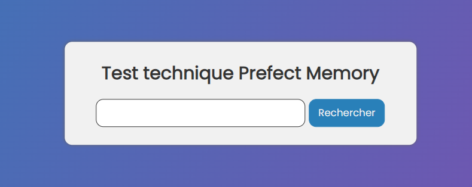
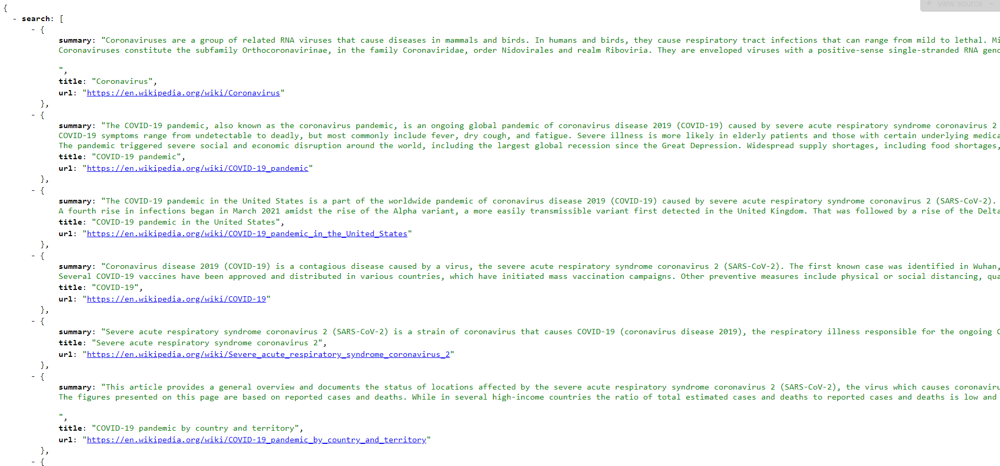

# Test Technique Prefect Memory

API Restful JSON en Python autour de l'analyse de texte. L'API doit permettre à l'utilisateur de saisir un texte en entrée pour obtenir en sortie une liste de personnes évoquées dans le texte avec quelques informations basiques




## Tester le l'application

Tout d'abord assurez vous d'avoir une connexion internet et installer python sur votre machine.

**1. Récuperer le projet**

Ouvrer un terminal et exécuter les commandes suivantes:

```bash
mkdir test-technique-prefect-memory
cd test-technique-prefect-memory
git clone https://github.com/Macktireh/test-technique-prefect-memory.git .
```

**2. Créer et activer un environnement virtual**

Toujours dans le terminal exécuter les commandes suivantes

Créer l'environnement virtual:
```bash
python -m venv .venv
```

Activer l'environnement virtual:

***Pour Windows :***

```bash
.venv\Scripts\activate.bat
```

***Pour Linux et Mac os :***

```bash
source .venv/bin/activate
```

**3. Activer l'environnement virtual**

Toujours dans le terminal exécuter la commande suivante


```bash
pip install -r requirements.txt
```

**3. Lancer l'application**

Toujours dans le terminal exécuter esa commandes suivantes

##### Sans docker

```bash
python app.py
```

Ouvrer un navigateur et allez sur <http://127.0.0.1:5000>

### Avec docker

***Pour Windows et Mac os :***

```bash
docker build -t test-technique-prefect-memory .
docker run -p 5000:5000 test-technique-prefect-memory
```

***Pour Linux :***

```bash
sudo docker build -t test-technique-prefect-memory .
sudo docker run -p 5000:5000 test-technique-prefect-memory
```
